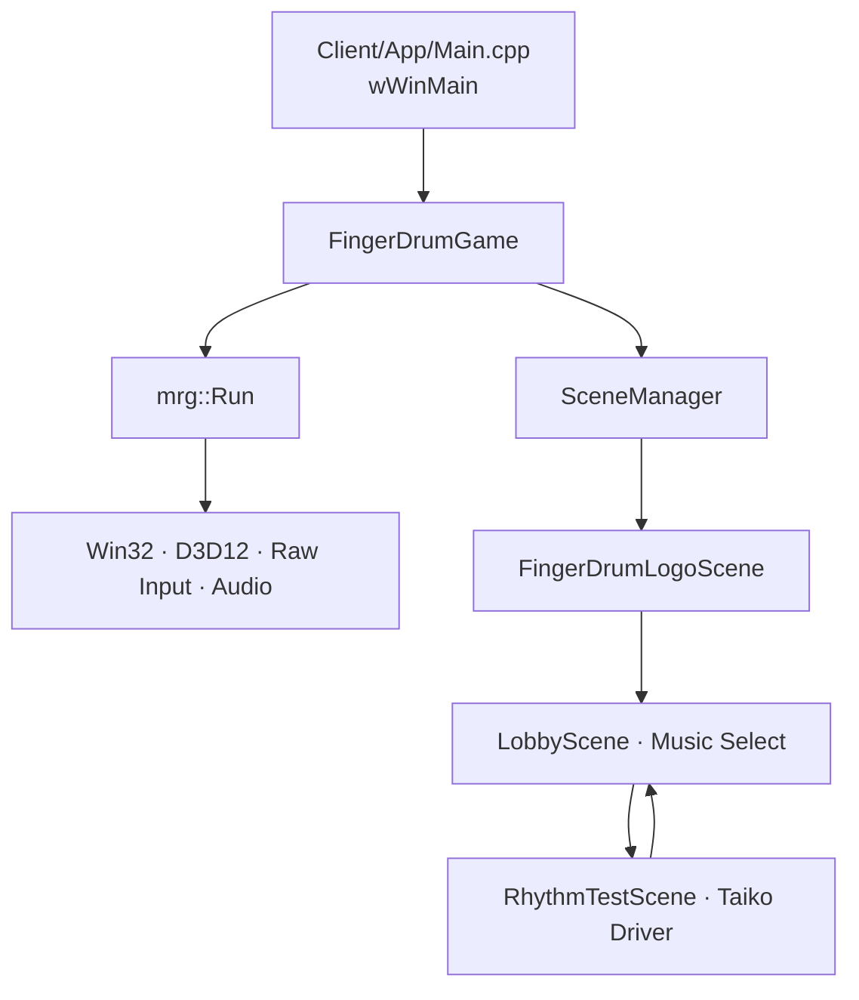

# FingerDrum 실행 흐름과 객체 수명

엔진은 Win32, D3D12, 입력, FMOD와 프레임 루프를 소유하고 Client는
게임 설정과 Scene을 소유합니다.

## 시작

1. `wWinMain`이 Debug CRT 누수 검사를 켜고 `FingerDrumGame`을 생성합니다.
2. `mrg::Run`이 `GetEngineConfig`를 읽어 창, 렌더러, Raw Input과 오디오를
   초기화합니다.
3. `RegisterScenes`가 Logo, Lobby, RhythmTest route를 등록합니다.
4. `SceneManager`가 최초 Logo Scene을 활성화하고 `Initialize`를 한 번
   호출합니다.

## Scene 흐름

- Logo에서 Game Start를 누르면 Lobby로 이동합니다.
- Lobby는 Penpot의 `Music Select · Sky` 화면을 Visual2D 트리로 구성합니다.
  곡 행을 클릭하거나 방향키로 선택하고 PLAY 또는 Enter로 테스트 플레이에
  진입합니다.
- RhythmTest는 `TaikoMode`로 세션을 만들고 한 개의 `RhythmTimer`로 입력,
  판정, 스크롤, 오디오 DSP 예약 시각을 연결합니다. Escape는 Lobby로
  돌아갑니다.
- 세 Scene은 현재 `KeepAlive`입니다. Scene 전환 시 객체는 남지만 입력과
  렌더링은 활성 Scene만 수행합니다. 실제 곡별 Play Scene은 패턴별 상태가
  무거워지면 `DestroyOnExit`로 등록할 수 있습니다.

## 프레임과 종료

매 update에서 엔진은 timestamp가 보존된 Raw Input 이벤트를 Client에
전달합니다. 각 Scene은 논리를 갱신하고 Visual2D draw packet만 제출하며,
D3D12 command 기록과 present는 엔진이 담당합니다. 종료 시 활성 Scene부터
`Shutdown`하여 Canvas observer와 오디오 voice를 먼저 해제한 후 엔진 장치를
역순으로 종료합니다.
