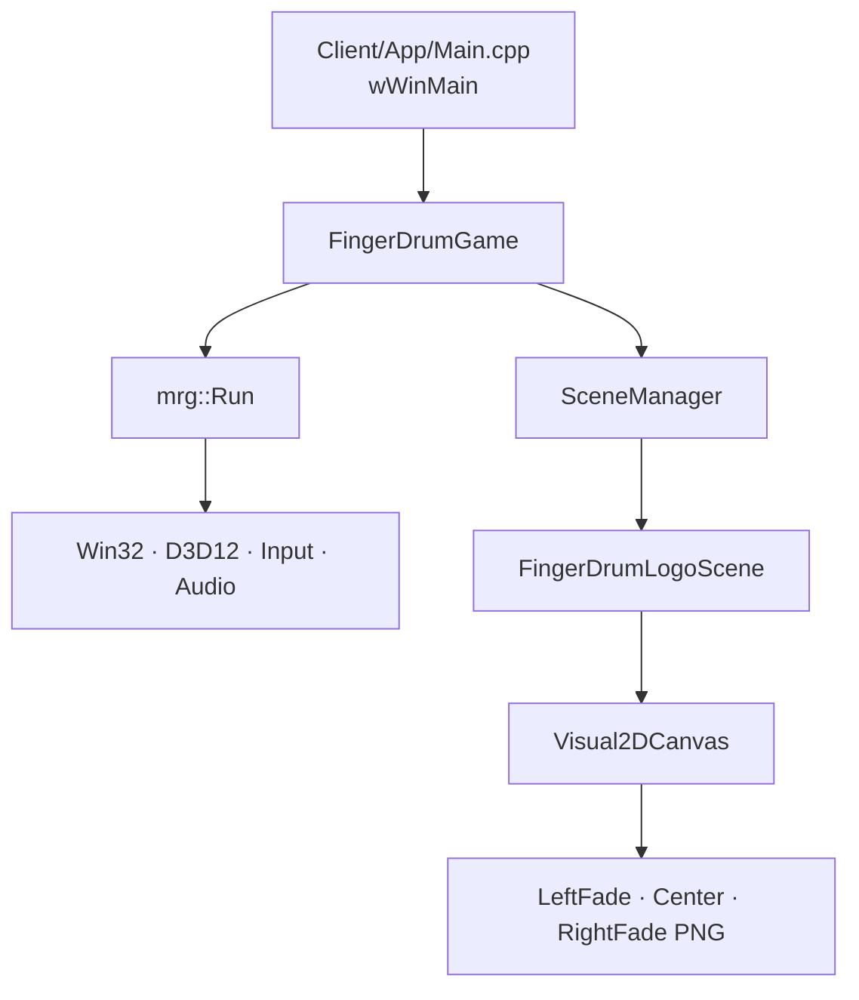

# FingerDrum 실행 흐름과 객체 수명

현재 Client의 기본 실행 경로는 큐브 샘플이 아니라 FingerDrum의 로고 화면이다.
엔진은 창, D3D12, 입력, 오디오와 프레임 루프를 소유하고, Client는 게임 설정과
Scene만 소유한다.

1. `wWinMain`이 CRT leak 검사를 활성화하고 `FingerDrumGame`을 생성한다.
2. `mrg::Run`이 엔진 시스템을 초기화한 뒤 `FingerDrumGame::GetEngineConfig`의
   AliceBlue clear color와 창 설정을 적용한다.
3. `FingerDrumGame::RegisterScenes`가 `FingerDrum.Logo` route를 등록하고,
   `SceneManager`가 `FingerDrumLogoScene`을 생성한다.
4. 로고 Scene은 세 PNG를 읽어 `Visual2DCanvas`에 배치한다. 매 resize 때 전체
   이미지 스트립의 scale을 다시 계산하므로 가장자리 이미지가 화면 밖으로 밀리지
   않는다.
5. Render 단계에서 Scene은 Canvas를 제출한다. 실제 D3D12 명령 기록·배치·present는
   엔진의 렌더 단계가 수행한다.
6. 종료 시 Scene이 Canvas와 node observer를 먼저 해제한 뒤, `mrg::Run`이 엔진
   시스템을 역순으로 종료한다.

이후 title menu, 곡 선택, 플레이, 결과 화면은 `Client/GameFlow/FingerDrumSceneIds.h`
에 route를 추가하고 `FingerDrumGame`에서 등록한다. 게임별 기능은 Client에 두고,
다른 게임에서도 재사용할 계약만 MRG-Engine으로 이동한다.
