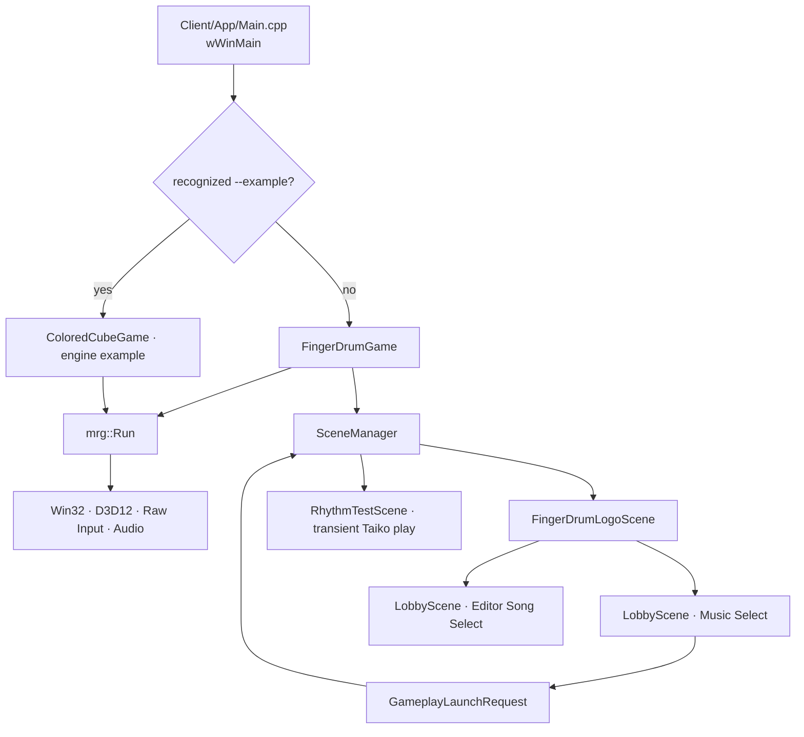

# FingerDrum 실행 흐름과 객체 수명

엔진은 Win32, D3D12, 입력, FMOD와 프레임 루프를 소유하고 Client는
게임 설정과 Scene을 소유합니다.

## 시작

1. `wWinMain`이 Debug CRT 누수 검사를 켭니다. 일반 실행과 FingerDrum smoke는
   `FingerDrumGame`을 생성하고, 인식된 `--example=mesh|collision|widgets` 경로는
   재사용 엔진 검증용 `ColoredCubeGame`을 생성합니다.
2. `mrg::Run`이 `GetEngineConfig`를 읽어 창, 렌더러, Raw Input과 오디오를
   초기화합니다.
3. `RegisterScenes`가 Logo, Lobby, EditorSongSelect, RhythmTest route를 등록합니다.
4. `SceneManager`가 최초 Logo Scene을 활성화하고 `Initialize`를 한 번
   호출합니다.

`SceneGameClient`는 SceneManager, 공통 AudioPlaybackManager와 화면
ScreenVisual2DManager를 함께 소유합니다.

엔진 루프에서 예외가 발생하면 GPU 대기를 최선으로 시도한 뒤 Client를 먼저
Shutdown하고, 그 다음 Audio와 renderer 지역 객체를 정리합니다. 따라서 Scene이
보관한 Canvas·이미지·voice는 해당 서비스를 참조할 수 있는 동안 해제됩니다.
`FingerDrumGame`은 gameplay factory에 `AudioPlayback()` 참조를 전달하고,
GameplayAudioRouter는 이를 통해 재생하며 세션에 속한 ID만 관리합니다.
Scene 전환 자체는 공통 재생을 중단하지 않습니다. Client 갱신 후 끝난 재생을
정리하고 종료 시에는 Scene의 세션 정리 후 남은 전역 재생을 모두 정지합니다.

## Scene 흐름

- Logo에서 Game Start를 누르면 Lobby로 이동합니다.
- Logo에서 Editor를 누르면 기록 패널이 없는 EditorSongSelect로 이동합니다.
  이 Scene은 Lobby의 카탈로그·미리듣기·검색·정렬·곡/난이도 탐색을 공유하며,
  실제 편집 workspace 전환은 아직 연결하지 않습니다.
- Lobby는 Penpot의 `Music Select · Sky` 화면을 Visual2D 트리로 구성합니다.
  `SongCatalog`가 기존 YMM 5개와 YMP 8개 및 선택적 로컬 패턴을 연결해 표시합니다.
  포커스된 곡 카드만 난이도 목록을 펼치며 좌우키는 곡, 상하키는 난이도를
  이동합니다. 하단 BACK 버튼이나 Escape로 Logo에 돌아갑니다.
- Lobby의 GO/Enter는 선택 경로를 `GameplayLaunchRequest`에 기록한 뒤
  RhythmTest 전환을 요청합니다. RhythmTest는 `TaikoMode`로 한 Lane 세션을
  만들고 한 개의 `RhythmTimer`로 입력, 판정, 스크롤, 음악과 히트사운드의 DSP
  예약 시각을 연결합니다.
- Logo와 Lobby는 `KeepAlive`, gameplay route는 `DestroyOnExit`입니다.
  gameplay 등록 시에는 factory만 보관하고 곡 선택 후 `ChangeScene`이 호출될
  때 해당 모드의 객체를 동적으로 생성합니다.
- gameplay에서 Escape를 누르거나 모든 노트를 처리한 뒤 3초가 지나면 Lobby
  전환을 요청합니다. update가 끝난 다음 `EndScene → Shutdown → delete` 순서로
  gameplay 객체가 파기되므로 다음 곡이나 모드의 상태가 남지 않습니다.
- 결과 Scene이 설계되면 gameplay 객체 대신 점수·판정 통계만 별도의 결과
  데이터로 이동시키고 같은 transient 수명 정책을 유지합니다.

## 프레임과 종료

매 update에서 엔진은 timestamp가 보존된 Raw Input 이벤트를 Client에
전달합니다. 각 Scene은 논리와 관리자가 소유한 Visual2D tree만 갱신하며,
화면 Canvas의 Update·resize·제출은 `ScreenVisual2DManager`가 수행합니다.
D3D12 command 기록과 present는 엔진이 담당합니다. 종료 시 활성 Scene부터
`Shutdown`하여 Canvas observer와 오디오 voice를 먼저 해제한 후 엔진 장치를
역순으로 종료합니다.

`FingerDrumGame`의 Client hook은 F7을 감지하고 게임용 Rajdhani 글꼴의 FPS와
UPS를 Scene 렌더 뒤 우측 하단에 제출합니다. 이 표시는 Scene이나 엔진 루프의
소유물이 아니므로 Scene 전환과 관계없이 유지됩니다.
