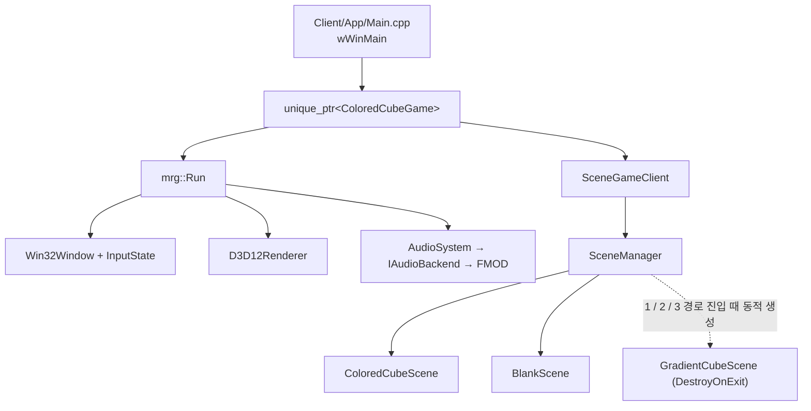
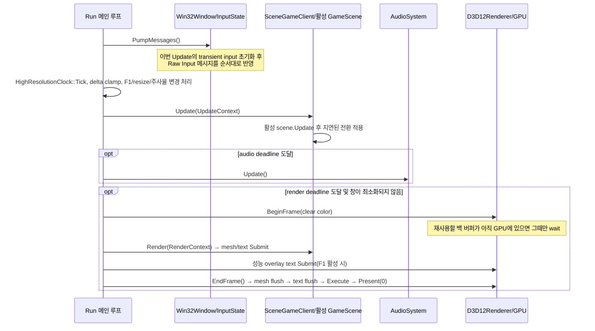

# 실행 흐름과 객체 수명

이 문서는 현재 `MRG.Client` 샘플을 기준으로, 프로그램을 시작했을 때의
호출 순서와 엔진/클라이언트 객체의 소유 관계를 설명한다. 새 Client를 만들
때에는 이 문서의 `IGameClient` 또는 `SceneGameClient` 경계를 유지하면 엔진
프로젝트를 바꾸지 않고 게임 코드만 교체할 수 있다.

## 한눈에 보는 소유 관계



- `Run`은 실행 중인 시스템 객체를 스택에 소유한다. 즉, `Win32Window`,
  `InputState`, `D3D12Renderer`, `AudioSystem`, `HighResolutionClock`은 엔진이
  만들고 파괴한다.
- Client는 `std::unique_ptr<IGameClient>`로 `Run`에 전달된다. 현재 Client인
  `ColoredCubeGame`은 `SceneGameClient`를 상속하며 내부에 `SceneManager`를
  값으로 소유한다.
- `mrg::scene::Camera`는 장면이 값으로 소유하는 backend-neutral 카메라다.
  D3D12 device나 command list를 소유하지 않으며, 행렬은 `MeshInstance`
  제출 데이터에 포함된다.
- `SceneManager`는 ID별 Scene 팩토리와 `SceneRetention` 정책을 등록한다.
  `KeepAlive` 객체는 최초 진입 뒤 Client 종료까지 재사용하고,
  `DestroyOnExit` 객체는 경로 진입마다 생성해 다른 경로로 나갈 때 종료·삭제한다.
- `EngineServices`의 `MeshRenderSystem`, `TextRenderSystem`,
  `AudioSystem` 참조는 **빌린 참조**다. Client나 Scene은 이를 해제하지 않으며,
  `IGameClient::Shutdown` 이후 사용하거나 보관해서는 안 된다.

## 시작 순서

`Client/App/Main.cpp`의 `wWinMain`이 유일한 프로그램 진입점이다.
`--smoke-test` 명령행 인수가 있으면 동일한 경로로 초기화하되, 창을 숨기고
세 번 렌더링한 뒤 종료하도록 Client 설정만 바뀐다.

```text
wWinMain
└─ std::make_unique<ColoredCubeGame>(smokeTest)
   └─ mrg::Run(client)
      ├─ client->GetEngineConfig()
      ├─ ComApartment: CoInitializeEx(COINIT_MULTITHREADED)
      ├─ HighResolutionClock: QPC 주파수와 시작 counter 기록
      ├─ Win32Window::Initialize(..., InputState)
      │  ├─ 윈도우 클래스 등록 및 HWND 생성
      │  ├─ Raw Input 키보드/마우스 장치 등록
      │  ├─ QPC 주파수를 InputState에 기록
      │  └─ 창이 있는 모니터의 명목 주사율 확인
      ├─ D3D12Renderer::Initialize(HWND, width, height)
      │  ├─ DXGI 팩토리와 고성능 어댑터/필요 시 WARP 선택
      │  ├─ ID3D12Device, 직접 명령 큐, 명령 할당자 2개, 명령 목록, fence 생성
      │  ├─ flip-discard 스왑 체인 및 RTV/DSV 힙 생성
      │  ├─ 백 버퍼 2개, depth-stencil, viewport/scissor 생성
      │  ├─ MeshRenderSystem 초기화
      │  │  ├─ TextureManager의 shader-visible SRV heap과 업로드 명령 객체 생성
      │  │  ├─ 라이브러리에 내장된 메시 HLSL 컴파일
      │  │  └─ MaterialTemplate의 root signature와 PSO 생성·캐시
      │  └─ TextRenderSystem 초기화
      │     ├─ DirectWrite factory와 텍스트 root signature/PSO 생성
      │     ├─ 라이브러리에 내장된 Text HLSL 컴파일
      │     └─ 글리프 아틀라스용 shader-visible SRV heap 생성
      ├─ AudioSystem::Initialize(...)
      │  └─ 주입한 factory 또는 기본 FMOD IAudioBackend 초기화
      ├─ 성능 오버레이용 두 글꼴 로드
      ├─ EngineServices 생성 (위 시스템의 비소유 참조 묶음)
      └─ client->Initialize(services)
         └─ SceneGameClient::Initialize
            ├─ SceneManager::Initialize(services)
            ├─ ColoredCubeGame::RegisterScenes
            │  ├─ Cube / Blank 팩토리를 KeepAlive 정책으로 등록
            │  └─ Gradient.Blue / Red / Green 팩토리를 DestroyOnExit 정책으로 등록
            └─ SceneManager::Start("Cube")
               ├─ ColoredCubeScene 생성 → ColoredCubeScene::Initialize
               │  ├─ 서로 다른 크기의 PNG 두 장을 독립 Texture2D로 업로드
               │  ├─ 두 SRV를 한 TextureSet 디스크립터 배열로 구성
               │  ├─ CubeShape를 PositionUvColor GpuMesh로 한 번 업로드
               │  ├─ 공통 textured MaterialInstance를 한 번 생성
               │  └─ 같은 mesh/material을 무작위 Transform의 MeshInstance 네 개에 연결
               ├─ ColoredCubeScene::BeginScene
               └─ ColoredCubeScene::OnResize
```

`GameScene::Initialize`/`Shutdown`은 Scene 객체 수명에 한 번씩 호출한다.
`KeepAlive` 객체는 최초 진입/Client 종료 시점에, `DestroyOnExit` 객체는 각
진입/이탈 시점에 호출된다. GPU 리소스, 파일처럼 생성 비용이 있는 항목을 여기에
둔다. `BeginScene`/`EndScene`은 활성화마다 호출되므로 카운트다운 초기화,
카메라 재배치 같은 활성화별 상태에 사용한다.

## 초기화가 끝난 직후의 상태

정상 초기화가 끝나면 다음 객체들이 존재한다.

| 영역 | 객체 | 역할 |
| --- | --- | --- |
| 플랫폼 | `Win32Window`, `InputState` | HWND, 메시지 펌프, Raw Input 상태/이벤트 |
| 시간 | `HighResolutionClock` | QPC 기반 전체 시간과 각 Update의 경과 시간 계산 |
| 그래픽 | `D3D12Renderer`, `MeshRenderSystem`, `TextureManager`, `TextRenderSystem` | device, queue, swap chain, frame resources, 공통 MaterialTemplate, 독립 크기 Texture2D와 SRV heap, GPU mesh 인스턴스 배치, DirectWrite 레이아웃과 D3D12 글리프 아틀라스 |
| 오디오 | `AudioSystem`, 선택된 `IAudioBackend` | 오디오 장치 정보와 DSP clock을 제공; 현재 기본 구현은 FMOD |
| 클라이언트 | `ColoredCubeGame` | 창/오디오/스케줄 설정과 등록할 장면 정의 |
| 장면 | `SceneManager`, `ColoredCubeScene` | 현재 활성 장면은 `Cube`; `BlankScene`은 등록만 되었고 아직 생성되지 않음 |
| Cube 장면 | `MeshInstance` 4개, `Camera` | 같은 GpuMesh/Material handle, 장면별 Transform·UV·texture index를 보관 |

세 `GradientCubeScene` 경로와 `BlankScene` 객체는 초기화 직후에는 존재하지
않는다. `ColoredCubeScene`에서
숫자 1/2/3을 눌렀을 때 각각 청색 1개, 적색 2개, 녹색 3개 큐브 설정으로
생성되며, 그 Scene에서 Space를 누르면 `Cube`로 복귀한 뒤 삭제된다.

`EngineServices` 자체는 `Run`의 지역 변수지만, 담긴 시스템 객체들은
`Run`이 끝날 때까지 살아 있다. 현 구조에서 `SceneManager`는 등록된 팩토리가
각 Scene 객체를 생성하고 초기화할 때 이 서비스를 사용한다. 장면은
`MeshRenderSystem`을 통해 GPU
리소스를 만들고 `MeshInstance`에 공유 handle만 보관한다. 글꼴 handle도
`TextRenderSystem`에서 한 번 만든 뒤 Client나 Scene이 공유 보관한다.

## 매 프레임(메시지 펌프 한 번) 흐름



### 입력

1. `PumpMessages`가 호출되면 `InputState::BeginUpdate`가 먼저 실행된다.
   이번 Update에만 의미 있는 `WasKeyPressed`, `WasKeyReleased`, 마우스 이동량,
   휠 이동량, 이벤트 배열을 초기화한다. `IsKeyDown`과 버튼 held 상태는 유지한다.
2. `WM_INPUT` 메시지는 `ProcessRawInput`에서 처리한다. 키보드는 Win32
   Virtual-Key 값으로, 마우스는 상대 이동/버튼/휠로 변환한다.
3. 각 입력 변화는 QPC timestamp와 함께 `InputState::Events()`에 순서대로
   저장된다. 미래의 리듬 판정은 렌더 프레임 번호나 단순 폴링 대신 이 이벤트
   목록과 오디오 DSP clock 보정값을 사용해야 한다.
4. 오른쪽 마우스 버튼을 누른 동안에는 커서를 클라이언트 영역에 가두고 숨긴다.
   샘플 `ColoredCubeScene`은 이 상대 이동으로 yaw/pitch를 바꾼다.

### 업데이트와 렌더의 분리

- `Update`는 고정 timestep이나 `Sleep` 없이 메시지 펌프가 끝나는 즉시 실행된다.
  `deltaSeconds`는 QPC로 계산하고 `EngineConfig::maximumUpdateDeltaSeconds`
  범위로만 clamp한다.
- 렌더는 `nextRenderTime`이 모니터의 명목 주사율(또는
  `renderRateOverrideHz`)에 도달한 경우에만 실행된다. 창이 최소화된 동안에는
  렌더하지 않지만 Update와 오디오 서비스는 계속 진행한다.
- `Present(0)`을 사용하며 지원되는 환경에서는 tearing을 허용한다. 따라서
  VSync가 Update 속도를 제한하지 않는다.
- D3D12의 정상 동기화는 `BeginFrame`의 `WaitForFrame(frameIndex)`뿐이다. 이
  함수도 **지금 재사용할** allocator/백 버퍼가 GPU에서 끝나지 않은 경우에만
  대기한다. 매 프레임 전체 GPU 완료를 기다리지 않는다.
- 오디오 업데이트도 `audioUpdateRateHz`(기본 500 Hz)의 별도 deadline으로
  호출된다. 이 주기는 렌더 주기와 독립적이다.

### 장면 업데이트와 전환

현재 활성 장면만 `Update`, `Render`, `OnResize`를 받는다. `ColoredCubeScene`은
`Escape`로 `SceneManager::Quit`, `Space`로 등록된 `BlankScene` 전환을
요청한다. 숫자 1/2/3은 Client 중앙 `GameFlow/SceneIds.h`에서 각각의
Gradient 경로 ID를 선택해 동일한 `ChangeScene`으로 전환을 요청한다.

`ChangeScene`은 즉시 장면을 교체하지 않고 `pendingAction_`에 요청만 넣는다.
`SceneManager::Update`는 기존 장면의 `Update`가 반환한 **다음**
`ApplyPendingAction`에서 아래 순서로 교체한다.

```text
oldScene::Update 반환
→ 필요한 경우 등록된 팩토리로 nextScene 생성 및 Initialize
→ oldScene::EndScene
→ currentScene을 nextScene으로 변경
→ nextScene::BeginScene
→ nextScene::OnResize(현재 크기)
```

이 지연 규칙 덕분에 장면이 자기 `Update` 도중 `ChangeScene`을 요청해도,
해당 멤버 함수가 실행 중인 상태에서 `EndScene`이 호출되거나 객체가 무효화되지
않는다. `Quit`도 같은 지연 경로를 통해 활성 장면의 `EndScene` 후 메인 루프를
종료한다.

모든 경로는 `RegisterScene`으로 팩토리와 수명 정책을 한 번 등록하고, 모든
전환은 `ChangeScene` 하나로 요청한다. `DestroyOnExit` 경로의 생성자와
`Initialize`는 기존 Scene의 `Update`가 반환된 뒤 지연 전환을 적용하면서
실행된다.

```text
ColoredCubeScene::Update에서 숫자 키 입력
→ 선택한 Gradient Scene ID를 pendingSceneId에 보관
→ ColoredCubeScene::Update 반환
→ 등록한 팩토리로 새 GradientCubeScene 생성
→ GradientCubeScene::Initialize
→ ColoredCubeScene::EndScene
→ GradientCubeScene::BeginScene / OnResize
```

Gradient Scene에서 Space를 누르면 등록된 `Cube` 전환을 요청한다.

```text
GradientCubeScene::Update 반환
→ GradientCubeScene::EndScene
→ GradientCubeScene::Shutdown
→ DestroyOnExit 객체의 unique_ptr 삭제
→ ColoredCubeScene::BeginScene / OnResize
```

직전 렌더가 아직 GPU에서 실행 중이어도 Scene 객체는 안전하게 삭제할 수 있다.
`MeshRenderSystem`의 각 frame resource가 그 프레임에 제출된 `GpuMesh`와
`MaterialInstance` 공유 핸들을 보관하며, 동일 frame index의 fence 대기가
끝난 다음 `BeginFrame`에서 해제하기 때문이다. Material이 `TextureSet`도
소유하므로 텍스처와 SRV 참조 역시 같은 기간 유지된다.

### Camera: 3D 원근과 2D 직교 투영

`MRG_Core.h`로 공개되는 `mrg::scene::Camera`는 왼손 좌표계
(`XMMatrixLookToLH`)의
view 행렬과 projection 행렬을 제공한다. 카메라가 GPU 리소스를 갖지 않으므로
하나의 장면에서 3D 월드, 2D HUD, 에디터 미리보기 카메라로 각각 사용할 수 있다.

```cpp
mrg::scene::Camera worldCamera;
worldCamera.SetPosition(0.0F, 0.0F, -5.0F);
worldCamera.SetPerspective(
    DirectX::XMConvertToRadians(60.0F),  // vertical FOV; radians
    aspectRatio,
    0.1F,
    1000.0F);
worldCamera.AddYawPitchRadians(yawDelta, pitchDelta);

mrg::scene::Camera uiCamera;
uiCamera.SetPosition(0.0F, 0.0F, -1.0F);
uiCamera.SetOrthographic(1920.0F, 1080.0F, 0.0F, 1.0F);
// 창 크기와 같은 논리 좌표계를 쓴다면 OnResize에서 호출한다.
uiCamera.SetOrthographicSize(newWidth, newHeight);
```

`SetPerspective`는 vertical FOV를 **라디안**으로 받고, `OnResize`에서는
`SetPerspectiveAspectRatio(width / height)`를 호출한다. `SetOrthographic`는
FOV 대신 보이는 월드 폭/높이를 받으므로 2D 좌표계를 그대로 projection에 넣을
수 있다. `ViewProjectionMatrix()`는 `ViewMatrix() * ProjectionMatrix()`를
반환하며, `MeshInstance::Submit`이 월드 행렬과 결합해 인스턴스 데이터로
전송한다.

### Shape, Material, MeshInstance와 인스턴싱

`Shape`는 CPU의 canonical 정점과 인덱스만 보관한다. Material, D3D12 resource,
Render 함수는 갖지 않는다. 장면 초기화에서 `MeshRenderSystem::CreateMesh`가
선택한 정점 레이아웃으로 Shape를 GPU에 올리고, `CreateMaterial`은 Graphics가
미리 만든 공통 `MaterialTemplate`을 참조하는 인스턴스를 반환한다.

```text
CubeShape (CPU)
→ GpuMesh (shared vertex/index resource)
   + MaterialInstance (shared root signature/PSO template)
   + TransformNode (per object)
→ MeshInstance
→ RenderContext.meshRendering->Submit
```

`Submit`은 draw를 즉시 호출하지 않는다. CPU render queue에
`GpuMesh + MaterialInstance + world-view-projection + color + UV transform +
texture index`를 기록한다.
`EndFrame`의 `Flush`가 동일한 Mesh와 Material 조합을 정렬하고, 프레임별
instance upload buffer의 연속 범위에 복사한 뒤 조합마다 한 번의
`DrawIndexedInstanced`를 기록한다. 현재 정육면체 네 개는 같은 handle을
공유하므로 instance count 4인 draw 한 번으로 배치된다.

### 서로 다른 크기의 텍스처와 UV

`TextureManager`는 WIC로 이미지를 RGBA8로 디코딩하고, 원본 너비와 높이를
유지한 별도의 `ID3D12Resource(Texture2D)`를 만든다. `TextureSet`은 같은 크기의
slice를 강제하는 `Texture2DArray`가 아니라, 이 리소스들을 가리키는 연속 SRV
디스크립터 묶음이다. 따라서 512×512와 512×337 이미지를 리사이즈 없이 같은
머티리얼에서 `texture index`로 선택할 수 있다.

업로드 명령은 장면 초기화 중 한 번 기록·실행하고 완료 fence를 기다린다.
임시 upload buffer를 안전하게 해제하기 위한 초기화 대기이며 정상 프레임의
Update/Render 경로에는 추가 대기가 없다.

정사각형 면에 가로로 긴 이미지를 채울 때는 `MakeCoverUvTransform`이 소스의
가로 UV 범위를 중앙 기준으로 줄여 좌우를 잘라낸다. 세로로 긴 이미지는 같은
방식으로 세로 범위를 줄인다. 비율을 늘려 찌그러뜨리거나 빈 여백을 만들지
않는다. 텍스처가 없는 인스턴스는 `NoTextureIndex`를 보내 정점 색을 사용하며,
텍스처가 있는 두 인스턴스와 같은 instancing batch를 유지한다.

### 렌더 한 번의 D3D12 처리

1. `D3D12Renderer::BeginFrame`은 대상 백 버퍼의 fence를 확인하고, 안전하면
   해당 frame allocator와 command list를 reset한다.
2. 백 버퍼를 `PRESENT → RENDER_TARGET`으로 전환하고, AliceBlue 색상과 depth를
   clear한다.
3. Client의 `Render`는 `MeshInstance`를 제출한다. 아직 draw command는
   기록하지 않는다. Client 텍스트도 `TextRenderSystem::Submit`으로 CPU
   레이아웃 결과만 제출한다.
4. `EndFrame`은 `MeshRenderSystem::Flush`로 제출 항목을 배치하고
   `DrawIndexedInstanced`를 기록한다. 이어 `TextRenderSystem::Flush`가 새
   글리프를 아틀라스에 업로드하고 page별 인스턴스 draw를 기록한다. 그 뒤
   백 버퍼를 `RENDER_TARGET → PRESENT`로 되돌리고 command list를 닫아 queue에
   제출한 뒤 `Present(0)`을 호출한다.
5. 제출 직후 fence 값을 기록한다. 다음 번에 같은 back buffer를 재사용할 때만
   이 값으로 GPU 완료를 확인한다.

## 종료 순서

정상 종료는 `Update`가 `false`를 반환하거나, 창이 `WM_QUIT`을 받거나,
smoke test가 세 번째 렌더링을 마친 후 발생한다.

```text
Run의 main loop 종료
├─ D3D12Renderer::WaitForGpu()
│  └─ 제출된 프레임이 MeshInstance의 GPU 리소스를 더 이상 참조하지 않도록 보장
├─ client->Shutdown()
│  └─ SceneGameClient → SceneManager
│     ├─ 활성 scene::EndScene()
│     ├─ 남아 있는 DestroyOnExit scene::Shutdown() 및 unique_ptr 해제
│     └─ 생성된 모든 KeepAlive scene::Shutdown() 및 unique_ptr 해제
├─ AudioSystem::Shutdown()
│  └─ IAudioBackend(FMOD)의 종료 및 해제
└─ Run 스코프 종료(RAII)
   ├─ D3D12Renderer 소멸자: 안전 확인 후 fence event handle 닫기
   ├─ Win32Window 소멸자: mouse capture 해제, HWND 파괴, class 해제
   └─ ComApartment 소멸자: CoUninitialize
```

순서가 중요하다. Client의 장면은 Graphics 리소스의 공유 handle을 보관하므로,
GPU가 작업을 끝낸 뒤이면서 renderer/device가 아직 살아 있는 상태에서
`client->Shutdown`을 호출해 handle을 해제한다. 예외가 나도 이미 초기화된
Client에는 먼저 `Shutdown`을 시도하고, 나머지 시스템은 지역 객체의 RAII
소멸자가 정리한다.

## 새 Client를 만들 때 지킬 경계

1. 새 실행 프로젝트에서 `IGameClient`를 직접 구현하거나
   `SceneGameClient`를 상속한다.
2. `GetEngineConfig`에는 창, clear color, 오디오 backend 선택, 스케줄 값을
   넣는다. 이 함수에서는 D3D12 리소스를 만들지 않는다.
3. `Initialize` 또는 `GameScene::Initialize`에서
   `EngineServices::meshRendering`으로 Shape를 `GpuMesh`로 올리고 Material을
   만든 뒤 `MeshInstance`에 연결한다. 공통 root signature나 PSO를 Client에서
   만들지 않는다.
4. 게임 상태 변화는 `UpdateContext`의 QPC 시간, Raw Input 이벤트, 오디오 DSP
   clock을 기준으로 계산한다. 렌더 프레임 수를 판정 시간 기준으로 사용하지
   않는다.
5. `Shutdown`에서 `MeshInstance::Reset`으로 Scene 소유 GPU handle을 해제한다.
   정상 종료 시에는 엔진이 GPU 완료를 먼저 기다리고, 동적 Scene 전환 중에는
   renderer frame resource가 제출된 handle을 fence 완료까지 별도로 보관한다.

엔진 내부는 기능별 실제 폴더에 `.h/.cpp`를 함께 두고 기능 프로젝트 루트를
include 기준점으로 사용한다. Client의 엔진 include 기준점은
`Dependencies/MRG-Engine/Engine/SDK`
하나이며 `MRG_Core.h`만 포함한다. `Backend/Fmod`, `Window/Win32Window.h`,
`Shader/ShaderCompiler.h`를 비롯한 기능·구현 헤더는 직접 참조하지 않는다.
