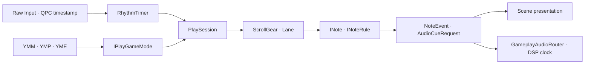

# FingerDrum 리듬게임 구조

이 구조의 기준은 “렌더 프레임 시각”이 아니라 timestamp가 붙은 입력 시각과
하나의 리듬 timeline입니다. 렌더 FPS가 흔들려도 판정 시각은 바뀌지 않습니다.

## 프로젝트 경계

- `FingerDrum.Rhythm`: 외부 라이브러리에 의존하지 않는 시간, 판정, 노트,
  Lane과 ScrollGear 논리입니다.
- `FingerDrum.Chart`: YMM/YMP/YME 파싱과 박자+BPM을 마이크로초로 한 번
  컴파일하는 계층입니다. 마디 길이와 마디 안의 `N/D` 위치는 64비트 유리수로
  누적하고 BPM 구간별 시간으로 변환한 뒤 최종 결과만 정수 microseconds로
  반올림합니다.
- `FingerDrum.Modes`: `IPlayGameMode`와 실제 노트 규칙을 생성하는 모드
  구현입니다. 현재 `TaikoMode`가 테스트 드라이버 역할을 합니다.
- `Client/Audio/GameplayAudioRouter`: 의미 기반 SoundId와 BusId를 엔진
  `AudioClip`, `AudioBus`, `AudioEffect`에 연결하는 게임 전용 계층입니다.
  실제 Voice는 `SceneGameClient::AudioPlayback()`이 소유하고 라우터는 해당
  플레이 세션의 재생 ID만 보관합니다. 일시정지·재시작·종료 시 그 ID만 제어하여
  다른 Scene이나 공통 UI의 재생에 영향을 주지 않습니다.

파일 등록은 라우터의 `RegisterSound`가 SoundId와 경로를 연결하고
`AudioSystem::LoadSound`로 Clip을 로드합니다. 음악은 Stream, 히트사운드는
Sample 방식이며 전역 파일 자동 검색이나 캐시는 없습니다. 같은 Sample을 가리키는
SoundId 별칭은 하나의 활성 Voice를 공유합니다. 이전 재생이 끝나기 전에 같은
Sample을 다시 요청하면 새 Channel을 만들지 않고 기존 Channel의 위치를 처음으로
되돌려 재생하며, 끝난 뒤 요청한 경우에만 새 Voice를 만듭니다. 재생 관리자는 재생 중
Clip/Bus의 공유 소유권을 유지합니다. 오디오 장치와 FMOD system은 `mrg::Run`이
소유하는 AudioSystem 하나가 관리합니다.

## 한 개의 타이머

`RhythmTimer` 하나가 QPC와 리듬 시간을 연결합니다. `AnchorDspClock`은 같은
리듬 시간을 오디오 장치의 sample clock에도 연결합니다. 배경음악과 BMS처럼
미래 시각에 예약할 음은 이 변환을 사용합니다. 실시간 입력 히트사운드는 QPC
timestamp로 판정한 직후 즉시 재생하며 DSP 미래 예약을 사용하지 않습니다.
별도의 `AudioTimeline`은 필요하지 않으며, 일시정지 후에는 DSP clock이 계속
흘렀으므로 현재 리듬 시각과 현재 DSP clock을 다시 anchor해야 합니다.

## 판정과 점수

`JudgementProfile`은 여러 개 생성할 수 있어 기본 노트와 싱코페이션 노트에
서로 다른 범위를 적용할 수 있습니다. 판정 레벨 50의 반범위는 다음과
같습니다.

| 등급 | ± 범위 |
| --- | ---: |
| MAX | 4.5 ms |
| Perfect | 9.5 ms |
| Great | 23.5 ms |
| Good | 54.5 ms |
| Bad | 90 ms |

레벨 `L`의 범위는 `50 / L`배가 됩니다. 따라서 레벨 100은 정확히 절반입니다.
점수는 판정 경계 사이를 선형보간합니다. 예를 들어 MAX 5 ms=100점,
Perfect 9 ms=90점이면 7 ms는 95점입니다.

## Lane과 배드말림 방지

Lane은 노트를 시간순으로 안정 정렬하고 가장 앞의 미처리 노트에 우선권을
줍니다. early Bad 입력은 시도만 보고하고 focus를 유지합니다. 현재 노트가
late Bad이며 다음 노트가 같은 입력을 Good 이내로 받을 수 있으면 앞 노트를
Miss 처리한 뒤 같은 입력을 다음 노트에 전달합니다.

현재 `TaikoMode`는 RPG `PlayScene`과 같은 방식으로 Don, Kat, BigDon,
BigKat, Purple, Roll, TickRoll, Balloon, DengDeng, Buzz를 모두 **한 Lane**에 넣습니다. long-note head를
받은 뒤 일치하는 tail을 받을 때까지 같은 Lane의 중복 head와 일반 Down은
무시합니다. 따라서 종류별 Lane을 따로 두지 않고 전체 노트의 시간순 focus와
배드말림 방지 규칙을 한 곳에서 적용합니다.

## 교체 가능한 노트 규칙

`RuleBasedNote`는 `INoteRule`과 `INoteSoundPolicy`를 조합합니다.

- `TapInputRule`: 한 번 누르는 노트
- `CountedHitInputRule`: 큰 노트처럼 횟수가 필요한 노트
- `SequenceInputRule`: 제한 시간 안에 순서가 필요한 노트. `allowAnyOrder`는
  보라 노트의 동·캇 각 1회를 순서와 무관하게 받습니다.
- `HoldInputRule`: 시작 판정, held 상태와 tick을 갖는 롱노트
- `DrumRollInputRule`: 구간 안의 반복 입력을 받는 드럼롤
- `TickRollInputRule`: 각 틱을 Good 범위에서 한 번만 받는 속도 제한 드럼롤
- `TimedSequenceInputRule`: Balloon의 반복 Don과 DengDeng의 Don/Kat 교대를
  제한 시간 및 필요 횟수로 처리하는 규칙

새 노트는 `INote` 전체를 다시 만들거나, 대부분의 경우 기존
`RuleBasedNote`에 새 `INoteRule`만 주입해 추가합니다.

## 노트별 정확도와 세션 집계

노트의 정확도 집계는 히트사운드/키빔의 개별 `JudgementResult`와 분리합니다.
`RuleBasedNote`가 rule의 목표와 수락된 이벤트로 `NoteAccuracy`를 갱신하고,
Completed/Missed에서 `NoteProcessResult::finalizedAccuracies`로 한 번만 내보냅니다.
`PlaySession`은 각 논리 노트에 동일한 가중치를 주어 평균을 계산합니다.
완료 전 노트는 누적 평균에서 제외하고, 미스 확정 노트는 부분 점수 또는 0점으로
포함합니다. `Reset()`은 현재/마지막 노트 상세와 누적 집계를 모두 초기화합니다.

| 노트 | 최종 정확도 |
| --- | --- |
| Don/Kat | 기존 선형 보간 타이밍 정확도 |
| BigDon/BigKat/Purple | `(1타 정확도 + 2타 정확도) / 2`, 미입력 항목은 0 |
| Roll/BigRoll/Balloon/DengDeng | `min(타격수 / 목표 타격수, 1)`; 시간 초과에도 부분 점수 보존 |
| TickRoll/BigTickRoll | `성공 틱 / 전체 틱`; 시작점도 틱, Good 이내면 1, 나머지는 0 |
| Buzz | `시작 정확도 × 0.5 + 시작점 이후 유지 틱 비율 × 0.5` |

Buzz가 틱 간격보다 짧아 몸통 틱이 하나도 없으면 존재하는 시작 판정만 사용합니다.
입력 시각 이전 틱은 이전 held 상태로 확정하고 입력과 같은 시각의 틱은 변경된
상태로 판정합니다. 같은 동작에 여러 키를 할당한 경우 마지막 키를 놓아야
유지가 해제됩니다. 예를 들어 시작 96%, 유지 98/100이면 최종 97%입니다.
보라 노트의 기본 히트사운드는 수락한 입력에 맞는 Don/Kat이며 명시적 hitsound도
지원합니다. 이는 게임별 라우터를 거치며 새 오디오 채널 정책을 추가하지 않습니다.

## 상태 기반 히트사운드

노트 규칙은 직접 FMOD를 호출하지 않습니다. 상태 전이인 `NoteEvent`를 만들고
`INoteSoundPolicy`가 이를 `AudioCueRequest`로 변환합니다. binding은 event,
이전/다음 상태, 판정 등급, hit index, tick index를 조건으로 사용할 수 있습니다.

- 큰 노트는 Good 이상인 첫 번째 accepted hit(`hitIndex == 0`)에서만 전용
  사운드를 냅니다.
- 범위 밖 입력은 노트 전용 사운드가 아니라 `UserInputFeedback` bus의 일반
  Don/Kat 사운드를 냅니다.
- 홀드 tick은 `TickAccepted`마다 한 번만 `TickSound` bus로 전달됩니다.

이 분리 덕분에 같은 노트 규칙을 유지한 채 스킨별 파일, 볼륨, pitch, pan,
우선순위와 bus를 바꿀 수 있습니다.

## 실시간 오디오 효과

YME의 `BusVolume`, `ReverbSend`, `LowPassCutoff`, `HighPassCutoff` 자동화는
`PlaySession::EvaluateAutomation`에서 timeline 값으로 평가한 후
`GameplayAudioRouter`가 엔진 bus/effect에 적용합니다. 향후 compressor,
delay 또는 모드 전용 효과는 차트 명령과 라우터 mapping을 추가하되 노트
규칙에서는 FMOD 타입을 참조하지 않습니다.

## 테스트 드라이버

`Client/Presentation/LaneKeyBeam`은 Lane 자식 `Lane.KeyBeam` 스프라이트와
200ms 선형 알파 페이드를 관리합니다. Scene은 등록된 게임 키의 Pressed 입력을
판정한 뒤 `OnKeyPressed(result)`를 전달합니다. 빈 입력/범위 밖 입력 및
정확도 없는 Roll tick은 흰색, 판정 결과는 RPG `AccuracyRange::DefaultAccInfo`의
흰색·하늘색·초록·노랑·보라와 점수 기반 보간, Good 이내 거부된 입력은 적색입니다.
수동 입력 결과만 빔을 시작하므로 자동 Miss나 키 해제는 빔을 생성하지 않습니다.
재입력은 같은 스프라이트의 색상과 알파를 초기화하고 200ms 후 숨깁니다.
페이드는 표시용 deltaSeconds로 진행되며 판정 타이머를 변경하지 않습니다.
`InGame/LaneLight.png`는 Lane 폭에 맞춰 비율을 유지하고 로컬 Y=0에서 시작하며,
Lane 끝에서 clip됩니다. PNG 원본 알파에 1→0의 표시 알파를 곱합니다.
Scene 종료 전에 빔의 observer를 해제하고 Canvas가 노드를 파기합니다.

`RhythmTestScene`은 Lobby가 선택한 YMP/YME를 `TaikoMode`에 전달해 세션을
만듭니다. `DestroyOnExit`이므로 매 플레이마다 새로 생성되고 Escape 또는 패턴
완료 3초 뒤 Lobby로 돌아갈 때 Canvas, audio voice, session과 함께 삭제됩니다.

플레이 화면의 기준 시안과 런타임 PNG 자산 원본은 Penpot의
[Gameplay · Sky](https://design.penpot.app/#/workspace?team-id=3be9e5e1-190f-8090-8008-7464803e8b40&file-id=3be9e5e1-190f-8090-8008-7468d9cc1bc8&page-id=618d0170-ff55-8025-8008-80646ceaa9d9)에 있습니다.
기존 곡 선택 화면의 Sky 색상과 타이포그래피를 유지하면서 짙은 밤하늘색 Lane,
ScrollGear 프레임, 마디선, 입력 키, 키빔, 롱노트 tick과 Balloon/DengDeng 남은
횟수 표시를 한 화면 계층으로 구성합니다.

입력 패널의 네 키는 Penpot 원본 좌표를 2/3로 축소해 배치합니다. 판정원 중심은
입력 패널 오른쪽에서 Lane 높이의 절반만큼 떨어져 있어, 중심에서 입력 패널과
Lane 위·아래까지의 거리가 같습니다. Lane과 ScrollGear 표면은 오른쪽 논리 화면
끝까지 이어지고 마지막 `Lane.png` 타일만 UV로 잘립니다.

노트와 플레이 HUD는 `Client/Assets/Skins/Default Skin/InGame`의 PNG로 그립니다.
`note.png`, `bignote.png`, `LNBody.png`, `LNTail.png`에는 Don/Kat/Roll Ambient
색상을 곱하고 대응하는 `*Overlay.png`는 흰색 원본으로 위에 그립니다. 일반/큰
롱노트는 서로 다른 body와 tail을 사용하고 Buzz tick은 마름모 자산을 사용합니다.
tail과 tail overlay는 별도로 회전하지 않고, 둥근 면이 위를 향하는 원본 방향
그대로 Lane 부모의 회전만 상속합니다.
기본 히트사운드는 `don.wav`, `kat.wav`, `bigdon.wav`, `bigkat.wav`입니다.
음악은 Stream으로 읽어 하나의 `RhythmTimer`가 가리키는 DSP 시각 0에 예약합니다.
Raw Input으로 발생한 히트사운드는 입력 timestamp를 판정에만 사용하고 즉시
재생합니다. 따라서 QPC와 장치 DSP clock의 장시간 미세 드리프트가 실시간 입력음을
미래 시각으로 예약해 지연을 누적시키지 않습니다.
오디오 초기화·파일 등록·재생 요청이 실패하면 가능한 나머지 파일 등록은 계속하고,
게임플레이 화면 상단에 첫 오류를 표시합니다. 오류는 무음으로 삼키지 않으며 노트
판정 시간축은 오디오 오류와 독립적으로 유지됩니다.

Lane 표시는 RPG `PlayScene`의 Transform 계층도 유지합니다. 기본 Lane은 로컬
`+Y` 방향으로 아래에서 위로 진행하는 세로 노드이며, Taiko 화면에서는 이 부모
노드 하나만 Z축 `-90°` 회전합니다. 어두운 단색 Lane, 마디선, key beam,
`JudgeLine`, 노트 head/overlay와 롱노트 body/tail/tick은 모두 Lane의 자식이므로
회전을 함께 상속합니다. 업데이트는 화면 X가 아니라 Lane 로컬 Y만 변경합니다.

`InGame` PNG는 1920×1080 제작 크기이므로 1280×720 논리 Canvas에서는 2/3
배율로 표시합니다. `Lane.png`는 원본 비율을 유지한 채 로컬 Y 방향으로 반복하고
마지막 조각만 UV로 잘라 창 폭을 채웁니다. Canvas의 `FixedHeight` 규칙에 따라
실제 1080p 출력에서는 PNG 원본 픽셀 크기로 표시됩니다.

현재 플레이 화면의 노트와 롱노트 파츠 크기는 PNG 메타데이터에서 계산합니다.
Canvas는 `FixedHeight`이므로 창 높이에 비례해 이미지와 글자도
함께 확대·축소되고, 넓은 창에서는 배경과 ScrollGear가 늘어나며 헤더·시간 표시는
각각 좌·우 기준으로 배치됩니다.

현재 플레이 화면은 마디선, key beam, 노트 head,
롱노트 body/tail/tick을 모두 회전된 Lane 부모 아래 둡니다. Balloon과 DengDeng은
일반 롱노트 body/tail 없이 전용 PNG만 사용합니다. 시작 시각부터 종료 시각까지
입력이 없으면 판정원에 멈추고, 첫 유효 입력부터 Penpot의 중앙 Focus UI로
전환합니다. Balloon은 `accepted/required` 진행률만큼 점차 커지고 완료하면
`BalloonBurst.png`를 200ms 표시합니다. DengDeng은 중앙의 소고를 회전시키고
완료하면 같은 처리 이미지를 200ms 동안 페이드아웃합니다. 제한 시간 안에
완료하지 못한 노트는 종료 시각부터 원래 Lane 속도로 판정원을 지나갑니다.
남은 횟수는 처리 중 `HitCounterCloud.png` 위에 표시합니다. 입력 패널은 각 키의 첫 번째
할당 키에 `KeyLightStrong`, 나머지 할당 키에 `KeyLightWeak`를 표시합니다.
점등 이미지는 흰색 알파 마스크에 노트와 같은 Ambient 색상을 곱하므로 Kat은
청색, Don은 적색으로 표시됩니다. 약한 불빛은 Ambient 색조와 45% tint 알파를
사용하고, 강한 불빛은 같은 색조의 채도를 높여 100% tint 알파로 표시하므로
PNG 자체의 밝기 차이와 함께 강·약 상태가 명확히 구분됩니다. 키를 누를
때마다 홀드 점등 위에 반투명 흰색 `KeyPressFlash` 십자광이 최대 불투명도로
다시 켜지고 0.1초 동안 선형으로 투명해진 뒤 사라집니다.
우측 정확도 표시는 같은 HUD 영역의 동적 텍스트로 노트별 평균을 소수점 두 자리까지
표시합니다. 아직 확정된 노트가 없으면 `--.--%`입니다.

Debug 빌드에서는 실행 인자와 무관하게 좌측 상단에 현재 포커스 노트의 ID,
상태, timing/expire(us), 개별 정확도와 마지막 확정 노트의 상세를 표시합니다.
큰 노트/보라 노트는 Hit1, Hit2, Final, Buzz는 시작 입력·유지 틱 비율·Final,
연타는 실제/목표 횟수·Final로 표시하여 최종값에 가려진 부분 항목도 확인할 수 있습니다.

- `D`, `K`: Kat
- `F`, `J`: Don
- `Space`: 일시정지/재개
- `R`: 처음부터 다시 시작
- `Escape`: 곡 선택으로 복귀

`MyRhythmGame.exe --rhythm-debug`는 엔젤드림 롱노트 테스트 패턴을 바로 열고
타이머를 일시정지합니다. `1`/`2`는 연속 뒤/앞 이동, `3`/`4`는 정확히
-1ms/+1ms 이동이며 화면에 현재 대상 노트와 시간 차이를 표시합니다. 상세 YMM,
YMP와 롱노트 옵션은 [ChartFormats.md](ChartFormats.md)를 참고합니다.

순수 로직 회귀 테스트는 `FingerDrum.Rhythm.Tests.exe`이며 판정 scaling,
보간 점수, Lane focus, 큰 노트 사운드, tick 중복 방지, legacy YMP와 YME를
검증합니다. `--catalog-root <Songs 경로>`를 붙이면 번들된 AngelDream YMM/YMP와
선택적 로컬 곡·패턴의 연관,
음악 파일 존재 여부와 모든 패턴의 단일-Lane 세션 생성까지 검증합니다.
